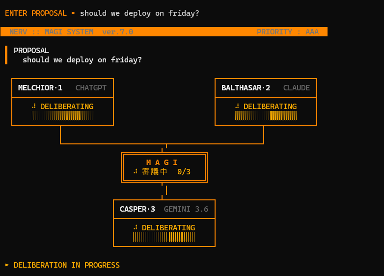

# MAGI SYSTEM

Three-core AI deliberation, Evangelion style. Submit a proposal, and three
independent AI cores — each running a different frontier model with a different
personality imprint — deliberate in parallel and resolve by majority vote, live
in your terminal.



| Core        | Imprint       | Model   | CLI      |
| ----------- | ------------- | ------- | -------- |
| MELCHIOR-1  | the scientist | ChatGPT | `codex`  |
| BALTHASAR-2 | the mother    | Claude  | `claude` |
| CASPER-3    | the woman     | Gemini  | `gemini` |

Why three models instead of one? The same reason NERV used three cores: a single
mind has blind spots. Each core argues strictly from its imprint — cold
feasibility, protective ethics, pragmatic intuition — so the vote surfaces
disagreement a single model would smooth over. Ask it something with real
tension ("Should we deploy on Friday?") and watch them split.

## Highlights

- **Zero dependencies** — one Node file, no `node_modules`. Talks to each model
  through its official CLI, so your existing logins are the only auth.
- **True parallel deliberation** — three subprocesses spawned at once, each with
  a per-core timeout, live status boxes, and elapsed timers.
- **Fault-tolerant voting** — a core that errors, times out, or isn't logged in
  shows OFFLINE and the remaining cores resolve by majority. 1–1 is a
  STALEMATE. If CASPER's primary model fails or rate-limits, it retries on a
  second Gemini model — free-tier quotas are per-model, so the fallback draws
  from a separate bucket.
- **A verdict protocol, not vibes** — every core must end with
  `VERDICT: APPROVED` or `VERDICT: DENIED`; abstention is not permitted. The
  parser takes the final verdict and keeps the reasoning.
- **Faithful terminal UI** — box-drawing layout, kanji status glyphs with
  correct CJK column widths, ANSI-stripped output cleaning per CLI. Set
  `MAGI_ASCII=1` if your font lacks CJK glyphs.

## Usage

```
magi "Should we deploy on Friday?"
```

or `node magi.js "..."`, or run with no arguments to be prompted.

## One-time setup

Each core logs in with its own account (no API keys):

1. `codex login` — opens a browser, sign in with your ChatGPT (Plus) account
2. `claude` then type `/login` — sign in with your Claude account, then `/exit`
3. Gemini: the CLI's free Google-login tier was discontinued (Aug 2026), so get a
   free API key at https://aistudio.google.com/apikey and run
   `setx GEMINI_API_KEY "your-key"` (new terminal windows pick it up).
   That one key covers Casper's fallback model too.

After changing magi.js, double-click `build.cmd` to rebuild `magi.exe`.

## How it works

`magi.js` builds one prompt per core — same proposal, different persona and the
verdict rules — and pipes it over stdin to each model's CLI as a child process.
While the cores think, the main loop redraws the three-box display with
spinners and progress bars. As each process closes, its stdout is stripped of
ANSI codes and CLI boilerplate, the last `VERDICT:` line is parsed out, and the
box flips to APPROVED (可決) or DENIED (否決). Anything that exits nonzero,
times out, or produces no verdict is marked OFFLINE (停止) with a summarized
error, and the vote proceeds with whoever is left.

## License

MIT © sage
